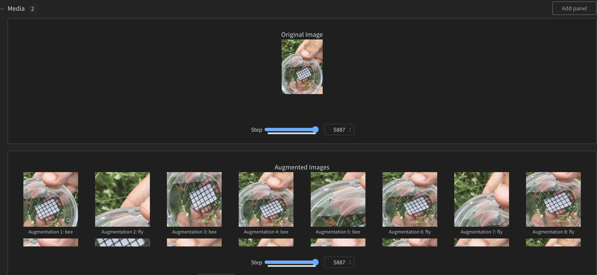

# Marginal entropy minimization with one test point (MEMO): Test Time Robustness via Adaptation and Augmentation 

Just using Random Resized Crop in augmentation with MEMO ~ >10% accuracy in adversarial images!

## Overview & top-1 Accuracy

This project implements [**Marginal Entropy Minimization with One Test Point (MEMO)**](https://proceedings.neurips.cc/paper_files/paper/2022/file/fc28053a08f59fccb48b11f2e31e81c7-Paper-Conference.pdf) for domain adaptation in image classification. It is based on the paper **"MEMO: Test Time Robustness via Adaptation and Augmentation"**, using the ImageNet-A dataset. The approach addresses domain shifts, adapting to each test sample individually without needing additional training data.

- Dataset: ImageNet-A, containing approximately 7,500 challenging images with significant domain shifts. The dataset poses a challenge due to:
  - Adversarial examples: Images are selected to be difficult for standard models.
  - Severe domain shifts: The test images differ greatly from training data, testing the model's adaptability.
- Backbone Model: [`CLIP`](https://github.com/openai/CLIP) (for zero-shot performance and as a model backbone). [Colab Notebook to start with CLIP](https://colab.research.google.com/drive/1MHc4Eq6iQ9qC3viIkcANw91JKJk6FwEv?usp=sharing)
- Overall Accuracy:
  - Zero-Shot: 38.17%
  - Adapted: 47.55%
    
The implemented MEMO model showed significant improvements in top-1 accuracy on the ImageNet-A dataset, effectively handling domain shifts.

## Why Test Time Robustification with MEMO?
This paper implements a novel approach to improve the robustness of deep neural networks at test time.Unlike many other test time training approach, it doesn't assume any information about the distribution/distribution shift on the test set and adapts each one by the following approach: 

1. Apply various data augmentations to each test example.
2. Adapt all model parameters by minimizing the entropy of the model's average output distribution across these augmentations.
3. This encourages consistent predictions across different augmentations while maintaining confidence.

- The approach requires no changes to the training process and works with any probabilistic and adaptable model. It has shown significant improvements in accuracy on several distribution shift benchmarks, including ImageNet-C, ImageNet-R, and ImageNet-A.


## Class Accuracies

You can see the class accuracies before and after adaptation in the `results.csv` file.

| #  | Baseline | Adapted | Total | Label                | Baseline Accuracy | Adapted Accuracy |
|----|----------|---------|-------|----------------------|--------------------|-------------------|
| 1  | 0        | 18      | 20    | African bush elephant| 0.6429             | 0.7143            |
| 2  | 1        | 24      | 42    | American alligator   | 0.3478             | 0.6087            |
| 3  | 2        | 18      | 18    | American black bear  | 0.5806             | 0.5806            |
| 4  | 3        | 25      | 56    | American bullfrog    | 0.2500             | 0.5600            |
| 5  | 4        | 44      | 84    | American robin       | 0.4400             | 0.8400            |
| 6  | 5        | 7       | 8     | Chihuahua            | 0.3333             | 0.3810            |
| 7  | 6        | 19      | 21    | Christmas stocking   | 0.8261             | 0.9130            |
| 8  | 7        | 4       | 6     | German Shepherd Dog  | 0.3077             | 0.4615            |
| 9  | 8        | 6       | 6     | Golden Retriever     | 0.3158             | 0.3158            |
| 10 | 9        | 26      | 30    | Persian cat          | 0.3514             | 0.4054            |
| 11 | 10       | 8       | 9     | Rottweiler           | 0.2286             | 0.2571            |
| 12 | 11       | 12      | 12    | Academic gown        | 1.0000             | 1.0000            |
| 13 | 12       | 2       | 4     | Accordion            | 0.4000             | 0.8000            |


## Setup and Execution

### Requirements

To set up the project on Google Colab, use the following commands:

```bash
!pip install ftfy regex tqdm -q
!pip install git+https://github.com/openai/CLIP.git -q
!pip install wandb
```

## Running the Project

Mount Google Drive:

```python
from google.colab import drive
drive.mount('/content/drive')
```
Ensure the root directory is set to the ImageNet-A folder under Notebook Configuration.
```bash
ImageNet-A/
│
├── n01440764/
│   ├── image1.JPEG
│   ├── image2.JPEG
│   └── ...
│
├── n01443537/
│   ├── image1.JPEG
│   ├── image2.JPEG
│   └── ...
│
├── n01514668/
│   ├── image1.JPEG
│   ├── image2.JPEG
│   └── ...
│
└── ...
```
For AWS SageMaker, refer to the `memo_sagemaker.ipynb` notebook for specific instructions.

#### Enabling Weights & Biases

If you would like to enable wandb to track your experiments, 
set `wandb_active = True` and login to your account. It's free to use with university account. 

[Also you can see our augmentations on a wandb report here](https://wandb.ai/project-zero/imagenet-adaptation-zehra/reports/Augmentations-for-MEMO--Vmlldzo4NTA1NTA1?accessToken=u37q32nxru6y6vir0glo3e9h616qscb09hj40gx2tq25mv6c6rxckrxjqk9m9os7)



## Recommendations for Further Improvements
1. Explore Different Backbones: Test other models besides CLIP to potentially improve adaptation performance.
2. Enhance Augmentation Techniques: Experiment with advanced data augmentation methods to bolster robustness.
3. Parameter Tuning: Conduct hyperparameter optimization for better adaptation results.We 
4. Real-World Testing: Apply the model to other datasets with varying domain shifts to evaluate generalizability.

PS: This is the implementation of the paper for the Deep Learning Master Course at the University of Trento. [March 2024]
